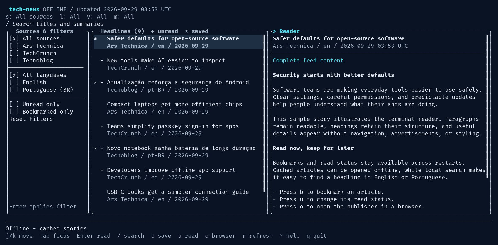

# tech-news

A C++20 terminal reader for English and Brazilian Portuguese technology news, with an English interface. Browse curated RSS/Atom feeds from Ars Technica, TechCrunch, and Tecnoblog; search locally; read public article text; and keep bookmarks and read status offline.



*Screenshot with sample stories.*

The interface uses [FTXUI 7.0.3](https://github.com/ArthurSonzogni/FTXUI/releases/tag/v7.0.3), a midnight navy palette, cyan focus, and ordinary terminal characters. It follows [Microsoft's keyboard and focus guidance](https://learn.microsoft.com/en-us/windows/win32/winauto/accessibility-best-practices) through visible focus, logical Tab navigation, and text equivalents for color indicators. No special fonts, API keys, accounts, or `.env` files are required.

## Prerequisites

Linux or macOS, a C++20 compiler (GCC 12+ or recent Apple Clang), CMake 3.24+, libcurl 7.85+, libxml2 2.9.10+, and SQLite 3.24+. Python 3.9+ runs the included offline checks. Internet access is needed for the first CMake configure to download the pinned, SHA-256 verified FTXUI archive.

Ubuntu 24.04 or newer / Debian with libcurl 7.85 or newer:

```sh
sudo apt update
sudo apt install build-essential cmake libcurl4-openssl-dev libxml2-dev libsqlite3-dev python3 xdg-utils
```

Fedora:

```sh
sudo dnf install gcc-c++ cmake libcurl-devel libxml2-devel sqlite-devel python3 xdg-utils
```

macOS with Homebrew:

```sh
xcode-select --install
brew install cmake curl libxml2 sqlite python
```

## Installation

From this directory on Linux:

```sh
cmake -S . -B build -DCMAKE_BUILD_TYPE=Release
cmake --build build --parallel
ctest --test-dir build --output-on-failure
cmake --install build --prefix "$HOME/.local"
```

On macOS, use this configure command before the same build, check, and install commands:

```sh
cmake -S . -B build -DCMAKE_BUILD_TYPE=Release \
  -DCMAKE_PREFIX_PATH="$(brew --prefix curl);$(brew --prefix libxml2);$(brew --prefix sqlite)"
```

Add `~/.local/bin` to your `PATH`, or run the executable directly from `build/tech-news`. Set `-DBUILD_TESTING=OFF` at configure time if Python is unavailable.

## Execution

```sh
tech-news
tech-news --offline
tech-news --help
tech-news --version
```

The app loads cached stories immediately and refreshes in the background. Source failures keep the usable cache and appear in the status line and help screen. Stories merge newest first and duplicate tracking URLs collapse into one story.

Technology, gadgets, AI, security, software, hardware, and technology companies are covered by these section feeds:

- [Ars Technology](https://feeds.arstechnica.com/arstechnica/technology-lab) and [Ars Gadgets](https://feeds.arstechnica.com/arstechnica/gadgets)
- [TechCrunch AI](https://techcrunch.com/category/artificial-intelligence/feed/) and [TechCrunch Security](https://techcrunch.com/category/security/feed/)
- [Tecnoblog News](https://tecnoblog.net/noticias/feed/)

Section endpoints and representative feed content were checked on September 28, 2026. Category and URL filters skip general science, entertainment, politics, military news, shopping offers, and unrelated content. Publisher categories are imperfect; filtering is best effort.

The preview shows the summary immediately. Enter marks the story read and opens the reader, using complete feed text when available or extracting the public page in the background. Paragraphs, headings, and lists are kept. Incomplete text and summary fallbacks are labeled; `o` opens the original page. Pages that return access errors are not bypassed, and extracted HTML completeness cannot be guaranteed.

## Configuration

Settings use standard environment variables:

| Variable | Behavior |
| --- | --- |
| `NO_COLOR` | When present, uses monochrome with explicit focus and status markers. |
| `XDG_DATA_HOME` | Linux: an absolute directory for user data; defaults to `~/.local/share`. |
| `HOME` | Locates default Linux storage and macOS user storage. |

The database is `tech-news/news.sqlite3` under the Linux data directory, or `~/Library/Application Support/tech-news/news.sqlite3` on macOS. It stores stories, fetched text, bookmarks, read status, and the latest successful refresh time. Unbookmarked stories expire 30 days after publication (or first-seen time when the date is missing); bookmarked stories remain until unbookmarked. Back up the data directory while the app is closed.

Requests verify TLS, allow only HTTP(S), and are limited to a 5-second connection timeout, 20-second total timeout, four redirects, and 4 MiB of decoded response data. Feeds additionally have a 2 MiB parse limit. Work is cancelled on exit. Custom feeds, translation, accounts, and synchronization are outside this version.

## Controls

| Key | Action |
| --- | --- |
| Arrows or `j` / `k` | Move through headlines/filters; scroll the focused reader or help. |
| Page Up / Page Down, Home / End | Move a page or to the beginning/end of headlines and reader. |
| Tab / Shift+Tab | Change focused pane; `>` marks focus. |
| Enter | Read selected story, or apply the selected sidebar filter. |
| Escape | Return to headlines; clear search; close help. |
| `/` | Search titles and summaries locally; Enter keeps the query, Escape clears it. |
| `b` | Toggle bookmark; `*` means bookmarked. |
| `u` | Toggle read status; `+` means unread. |
| `s` / `l` | Cycle source / language filters. |
| `v` / `m` | Toggle unread-only / bookmarked-only filters. |
| `r` | Refresh all sources. |
| `o` | Open the selected article in the default browser. |
| `?` / `q` | Help / quit. |

At 110+ columns, the app shows filters, headlines, and a preview. Between 80 and 109 columns the sidebar collapses; use `s/l/v/m` for filters. Below 80 columns, Enter switches from the list to the reader and Escape returns. The minimum terminal size is 60 columns × 18 rows.

## Troubleshooting

- **Missing headers or an old curl:** install the development packages above. On macOS, use the Homebrew prefix configure command so CMake finds modern curl instead of the SDK version.
- **FTXUI download blocked:** configure once with network access, or point CMake to an already downloaded and verified 7.0.3 source directory using `-DFETCHCONTENT_SOURCE_DIR_FTXUI=/absolute/path/to/FTXUI-7.0.3`.
- **No stories offline:** start once without `--offline` to populate the cache. Help lists individual source failures. Publisher endpoints and availability can change.
- **Incomplete article or HTTP 403:** the public page may block automated requests or require a subscription. Read the available feed text, or use `o` in your browser.
- **No results:** Escape clears search; check source/language/unread/bookmark filters. The wide sidebar also has Reset filters.
- **Browser opening fails on Linux:** install `xdg-utils` and configure a default browser in your desktop session.
- **Storage error:** check write permissions and free space in the data directory. Do not run as root. Close other instances before backing up or restoring the database.
- **Colors are hard to read:** run `NO_COLOR=1 tech-news`. Resize small terminals when prompted.
- **Input/output error:** run in an interactive terminal, not through a pipe. Normal quit and Ctrl-C restore the terminal; after a forced process kill, run `reset` if necessary.
